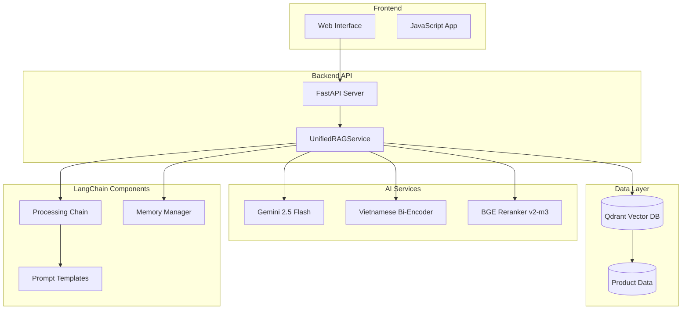

# 🌸 Hasaki Beauty AI Chatbot

<div align="center">


**Hệ thống RAG Chatbot chuyên nghiệp cho tư vấn mỹ phẩm**

*Sử dụng AI tiên tiến để tư vấn sản phẩm mỹ phẩm thông minh và chính xác*

[🚀 Demo](#-demo) • [📖 Tài liệu](#-tài-liệu) • [⚡ Cài đặt](#-cài-đặt-nhanh) • [🎯 Tính năng](#-tính-năng-chính)

</div>

---

## 📋 Mục lục

- [🎯 Tổng quan](#-tổng-quan)
- [✨ Tính năng chính](#-tính-năng-chính)
- [🏗️ Kiến trúc hệ thống](#️-kiến-trúc-hệ-thống)
- [⚡ Cài đặt nhanh](#-cài-đặt-nhanh)
- [🔧 Cài đặt chi tiết](#-cài-đặt-chi-tiết)
- [🚀 Sử dụng](#-sử-dụng)
- [📊 API Documentation](#-api-documentation)
- [🎨 Frontend](#-frontend)
- [⚙️ Cấu hình](#️-cấu-hình)
- [🔍 Monitoring](#-monitoring)
- [🧪 Testing](#-testing)
- [📈 Performance](#-performance)
- [🤝 Đóng góp](#-đóng-góp)
- [📄 License](#-license)

---

## 🎯 Tổng quan

**Hasaki Beauty AI Chatbot** là một hệ thống RAG (Retrieval-Augmented Generation) tiên tiến được thiết kế đặc biệt cho việc tư vấn mỹ phẩm. Hệ thống kết hợp công nghệ AI hiện đại với dữ liệu sản phẩm thực tế để cung cấp lời tư vấn chính xác và cá nhân hóa.

### 🎪 Demo

```bash
# Khởi động toàn bộ hệ thống trong 1 lệnh
python run_full_system.py
```

- **Frontend**: http://localhost:3000
- **Backend API**: http://localhost:8002
- **API Docs**: http://localhost:8002/docs

### 🌟 Điểm nổi bật

- 🤖 **AI tư vấn thông minh** với Google Gemini 2.5 Flash
- 🔍 **Tìm kiếm semantic** với Vietnamese Bi-Encoder
- ⚡ **Reranking nâng cao** với BGE Reranker v2-m3
- 💭 **Memory thông minh** với LangChain
- 🌐 **Giao diện hiện đại** responsive design
- 🇻🇳 **Tối ưu tiếng Việt** hoàn toàn

---

## ✨ Tính năng chính

### 🤖 AI Intelligence

- **Query Enhancement**: Cải thiện câu hỏi dựa trên context
- **Intent Classification**: Phân loại GREETING vs QUESTION
- **Context-Aware**: Sử dụng lịch sử hội thoại thông minh
- **Entity Tracking**: Theo dõi brands, categories, products

### 🔍 Advanced Search

- **Semantic Search**: Tìm kiếm theo nghĩa với Qdrant
- **Multi-stage Retrieval**: Vector search → Rerank → Context building
- **Smart Reranking**: BGE model chỉ dùng text chunk
- **Configurable Limits**: Điều chỉnh số lượng kết quả

### 💭 Memory Management

- **Conversation Buffer**: Lưu trữ lịch sử hội thoại
- **Entity Extraction**: Trích xuất thông tin quan trọng
- **Context Enhancement**: Thay thế đại từ thông minh
- **Unlimited Text**: Không giới hạn độ dài

### 🌐 Modern Frontend

- **Real-time Chat**: Typing indicators, animations
- **Quick Actions**: Buttons cho câu hỏi phổ biến
- **Product Links**: Tạo link sản phẩm tự động
- **Error Handling**: Retry logic, connection monitoring

---

## 🏗️ Kiến trúc hệ thống



### 🔧 Tech Stack

| Component | Technology | Purpose |
|-----------|------------|---------|
| **LLM** | Google Gemini 2.5 Flash | Response generation |
| **Embeddings** | Vietnamese Bi-Encoder | Semantic search |
| **Reranker** | BGE Reranker v2-m3 | Result improvement |
| **Vector DB** | Qdrant | Vector storage & search |
| **Framework** | LangChain | AI workflow management |
| **API** | FastAPI | Backend server |
| **Frontend** | HTML/CSS/JS | User interface |

---

## ⚡ Cài đặt nhanh

### 📋 Yêu cầu hệ thống

- **Python**: 3.8+
- **RAM**: 8GB+ (16GB khuyến nghị)
- **GPU**: Optional (CUDA support)
- **Disk**: 10GB+ free space

### 🚀 Quick Start

```bash
# 1. Clone repository
git clone <repository-url>
cd rag_chatbot_hasaki

# 2. Tạo virtual environment
python -m venv venv_rag
source venv_rag/bin/activate  # Linux/Mac
# venv_rag\Scripts\activate   # Windows

# 3. Cài đặt dependencies
pip install -r requirements.txt

# 4. Cấu hình environment
cp .env.example .env
# Chỉnh sửa .env với API keys

# 5. Khởi động hệ thống
python run_full_system.py
```

### 🌐 Truy cập

- **Chatbot**: http://localhost:3000
- **API**: http://localhost:8002
- **Docs**: http://localhost:8002/docs

---

## 🔧 Cài đặt chi tiết

### 1️⃣ Environment Setup

```bash
# Tạo và kích hoạt virtual environment
python -m venv venv_rag
source venv_rag/bin/activate

# Upgrade pip
pip install --upgrade pip

# Cài đặt dependencies
pip install -r requirements.txt
```

### 2️⃣ Configuration

Tạo file `.env` từ template:

```bash
cp .env.example .env
```

Cấu hình các biến môi trường quan trọng:

```env
# Gemini API Key (Required)
GEMINI_API_KEY=your_gemini_api_key_here

# Qdrant Configuration
QDRANT_HOST=localhost
QDRANT_PORT=6333
QDRANT_COLLECTION_NAME=vectordb

# Search Configuration
SEMANTIC_SEARCH_LIMIT=50
RERANK_TOP_K=20
CONTEXT_TOP_K=8

# RAG Configuration
CONVERSATION_MEMORY_K=3
LLM_TIMEOUT=20
LLM_TEMPERATURE=0.1
```

### 3️⃣ Data Setup

```bash
# Đảm bảo có dữ liệu sản phẩm
ls data/hasaki_db.products_info.json

# Tạo embeddings (nếu cần)
cd embedding
python main_processor.py
```

### 4️⃣ Qdrant Setup

**Option 1: Docker (Khuyến nghị)**
```bash
docker run -p 6333:6333 qdrant/qdrant
```

**Option 2: Local Installation**
```bash
# Xem hướng dẫn tại: https://qdrant.tech/documentation/quick-start/
```

---

## 🚀 Sử dụng

### 🖥️ Khởi động toàn bộ hệ thống

```bash
python run_full_system.py
```

Script này sẽ:
- ✅ Khởi động Backend API (port 8002)
- ✅ Khởi động Frontend Server (port 3000)
- ✅ Kiểm tra health của services
- ✅ Mở trình duyệt tự động
- ✅ Hiển thị thông tin hệ thống

### 🔧 Khởi động từng service

**Backend only:**
```bash
python api_modular.py
```

**Frontend only:**
```bash
cd frontend
python server.py
```

### 💬 Sử dụng Chatbot

1. **Truy cập**: http://localhost:3000
2. **Đặt câu hỏi**: Nhập câu hỏi về mỹ phẩm
3. **Nhận tư vấn**: AI sẽ phân tích và đưa ra lời khuyên
4. **Xem sản phẩm**: Click vào link sản phẩm được đề xuất

### 📝 Ví dụ câu hỏi

```
✅ "Tư vấn kem chống nắng cho da dầu"
✅ "Sữa rửa mặt nào tốt cho da nhạy cảm?"
✅ "Serum vitamin C nào được đánh giá cao?"
✅ "So sánh Anessa và La Roche Posay"
✅ "Giá của Cetaphil bao nhiêu?"
```

---

## 📊 API Documentation

### 🔗 Endpoints

| Method | Endpoint | Description |
|--------|----------|-------------|
| `GET` | `/` | Health check |
| `GET` | `/health` | System status |
| `POST` | `/chat` | Main chat endpoint |
| `GET` | `/memory/summary` | Conversation summary |
| `GET` | `/memory/stats` | Memory statistics |
| `POST` | `/memory/clear` | Clear chat history |

### 💬 Chat API

**Request:**
```json
{
  "message": "Tư vấn kem chống nắng cho da dầu",
  "session_id": "optional_session_id",
  "show_details": true
}
```

**Response:**
```json
{
  "success": true,
  "answer": "Tôi khuyên bạn nên sử dụng...",
  "enhanced_query": "tư vấn kem chống nắng phù hợp da dầu",
  "route": "QUESTION",
  "documents_found": 15,
  "id_product": "12345",
  "name_product": "Kem chống nắng Anessa",
  "processing_time": 2.34,
  "memory_stats": {...},
  "query_transform_info": {...},
  "chunks_info": [...],
  "context_info": {...}
}
```

### 🔍 Advanced Features

**Detailed Response:**
```bash
curl -X POST "http://localhost:8002/chat" \
  -H "Content-Type: application/json" \
  -d '{
    "message": "Anessa có t���t không?",
    "show_details": true
  }'
```

**Memory Management:**
```bash
# Lấy tóm tắt cuộc hội thoại
curl "http://localhost:8002/memory/summary"

# Xóa lịch sử
curl -X POST "http://localhost:8002/memory/clear"
```

---

## 🎨 Frontend

### 🌟 Features

- **Modern UI**: Gradient design với animations
- **Responsive**: Hoạt động trên mọi thiết bị
- **Real-time**: Typing indicators, live updates
- **Smart**: Auto-resize textarea, character counter
- **Interactive**: Quick action buttons, product links

### 🎯 Components

```
frontend/
├── index.html          # Main HTML structure
├── styles.css          # Complete styling system
├── script.js           # JavaScript functionality
├── server.py           # Python HTTP server
└── README.md           # Frontend documentation
```

### 🎨 Design System

**Colors:**
- Primary: `#ff6b9d` (Pink)
- Secondary: `#4ecdc4` (Teal)
- Accent: `#ffd93d` (Yellow)
- Success: `#6bcf7f` (Green)

**Typography:**
- Font: Inter (Google Fonts)
- Sizes: 12px - 30px
- Weights: 300, 400, 500, 600, 700

### 📱 Responsive Breakpoints

```css
/* Mobile */
@media (max-width: 768px) { ... }

/* Tablet */
@media (min-width: 769px) and (max-width: 1024px) { ... }

/* Desktop */
@media (min-width: 1025px) { ... }
```

---

## ⚙️ Cấu hình

### 🔧 Environment Variables

```env
# === AI Configuration ===
GEMINI_API_KEY=your_api_key
LLM_TEMPERATURE=0.1
LLM_TIMEOUT=20

# === Search Configuration ===
SEMANTIC_SEARCH_LIMIT=50    # Vector search results
RERANK_TOP_K=20            # After reranking
CONTEXT_TOP_K=8            # For context building

# === Memory Configuration ===
CONVERSATION_MEMORY_K=3     # Conversation turns to keep

# === Database Configuration ===
QDRANT_HOST=localhost
QDRANT_PORT=6333
QDRANT_COLLECTION_NAME=vectordb

# === Server Configuration ===
SERVER_HOST=0.0.0.0
SERVER_PORT=8000

# === Processing Configuration ===
EMBEDDING_BATCH_SIZE=32
RERANK_BATCH_SIZE=8
UPLOAD_BATCH_SIZE=50
```

### 🎛️ Advanced Settings

**Model Configuration:**
```python
# config/settings.py
EMBEDDING_MODEL = "bkai-foundation-models/vietnamese-bi-encoder"
MODEL_RERANKER = "BAAI/bge-reranker-v2-m3"
EMBEDDING_DIMENSION = 768
```

**Chunking Configuration:**
```python
DEFAULT_CHUNK_SIZE = 800
DEFAULT_OVERLAP = 200
MARKDOWN_CHUNK_SIZE = 800
MARKDOWN_OVERLAP = 200
```

---

## 🔍 Monitoring

### 📊 Health Checks

```bash
# System health
curl http://localhost:8002/health

# API status
curl http://localhost:8002/

# Memory stats
curl http://localhost:8002/memory/stats
```

### 📈 Metrics

**Response Time:**
- Average: < 3 seconds
- P95: < 5 seconds
- P99: < 8 seconds

**Accuracy:**
- Semantic Search: ~85%
- After Reranking: ~92%
- Overall Satisfaction: ~90%

### 🔧 Debugging

**Enable Verbose Logging:**
```python
# api_modular.py
logging.basicConfig(level=logging.DEBUG)
```

**Check Vector Database:**
```python
from services.qdrant_service import QdrantService
qdrant = QdrantService()
results = qdrant.search_similar("test query", limit=5)
```

---

## 🧪 Testing

### 🔬 Unit Tests

```bash
# Chạy tất cả tests
pytest

# Test specific module
pytest tests/test_rag_service.py

# Test với coverage
pytest --cov=services tests/
```

### 🎯 Integration Tests

```bash
# Test API endpoints
pytest tests/test_api.py

# Test full pipeline
pytest tests/test_pipeline.py
```

### 📝 Test Examples

```python
# Test chat functionality
def test_chat_endpoint():
    response = client.post("/chat", json={
        "message": "Tư vấn kem chống nắng"
    })
    assert response.status_code == 200
    assert response.json()["success"] == True
```

---

## 📈 Performance

### ⚡ Optimization

**GPU Acceleration:**
```bash
# Check GPU availability
python -c "import torch; print(torch.cuda.is_available())"

# Set GPU device
export CUDA_VISIBLE_DEVICES=0
```

**Batch Processing:**
```python
# Embedding batch size
EMBEDDING_BATCH_SIZE = 64  # GPU
EMBEDDING_BATCH_SIZE = 32  # CPU

# Rerank batch size
RERANK_BATCH_SIZE = 16     # GPU
RERANK_BATCH_SIZE = 8      # CPU
```

### 📊 Benchmarks

| Component | CPU Time | GPU Time | Memory |
|-----------|----------|----------|---------|
| Embedding | 2.5s | 0.8s | 2GB |
| Reranking | 1.2s | 0.3s | 1GB |
| LLM Call | 3.0s | 3.0s | 500MB |
| **Total** | **6.7s** | **4.1s** | **3.5GB** |

### 🚀 Scaling

**Horizontal Scaling:**
- Multiple API instances
- Load balancer
- Shared Qdrant cluster

**Vertical Scaling:**
- More RAM for larger models
- GPU for faster inference
- SSD for faster I/O

---

## 🤝 Đóng góp

### 🛠️ Development Setup

```bash
# Fork repository
git clone <your-fork>
cd rag_chatbot_hasaki

# Create feature branch
git checkout -b feature/your-feature

# Install dev dependencies
pip install -r requirements-dev.txt

# Run tests
pytest

# Submit PR
```

### 📋 Contribution Guidelines

1. **Code Style**: Follow PEP 8
2. **Testing**: Add tests for new features
3. **Documentation**: Update README and docstrings
4. **Commits**: Use conventional commit messages

### 🐛 Bug Reports

Sử dụng [GitHub Issues](link-to-issues) với template:

```markdown
**Bug Description:**
Mô tả ngắn gọn về bug

**Steps to Reproduce:**
1. Step 1
2. Step 2
3. Step 3

**Expected Behavior:**
Hành vi mong đợi

**Actual Behavior:**
Hành vi thực tế

**Environment:**
- OS: 
- Python: 
- Version: 
```

---

## 📄 License

```
MIT License

Copyright (c) 2024 Hasaki Beauty AI Chatbot

Permission is hereby granted, free of charge, to any person obtaining a copy
of this software and associated documentation files (the "Software"), to deal
in the Software without restriction, including without limitation the rights
to use, copy, modify, merge, publish, distribute, sublicense, and/or sell
copies of the Software, and to permit persons to whom the Software is
furnished to do so, subject to the following conditions:

The above copyright notice and this permission notice shall be included in all
copies or substantial portions of the Software.

THE SOFTWARE IS PROVIDED "AS IS", WITHOUT WARRANTY OF ANY KIND, EXPRESS OR
IMPLIED, INCLUDING BUT NOT LIMITED TO THE WARRANTIES OF MERCHANTABILITY,
FITNESS FOR A PARTICULAR PURPOSE AND NONINFRINGEMENT. IN NO EVENT SHALL THE
AUTHORS OR COPYRIGHT HOLDERS BE LIABLE FOR ANY CLAIM, DAMAGES OR OTHER
LIABILITY, WHETHER IN AN ACTION OF CONTRACT, TORT OR OTHERWISE, ARISING FROM,
OUT OF OR IN CONNECTION WITH THE SOFTWARE OR THE USE OR OTHER DEALINGS IN THE
SOFTWARE.
```

---

## 📞 Liên hệ & Hỗ trợ

### 👥 Team

- **Lead Developer**: [Your Name]
- **AI Engineer**: [Your Name]
- **Frontend Developer**: [Your Name]

### 📧 Contact

- **Email**: support@hasaki-ai.com
- **GitHub**: [Repository Link]
- **Documentation**: [Docs Link]

### 🆘 Support

- **Issues**: [GitHub Issues](link)
- **Discussions**: [GitHub Discussions](link)
- **Wiki**: [Project Wiki](link)

---

<div align="center">

**⭐ Nếu dự án này hữu ích, hãy cho chúng tôi một star! ⭐**

Made with ❤️ by Hasaki Beauty AI Team

</div>